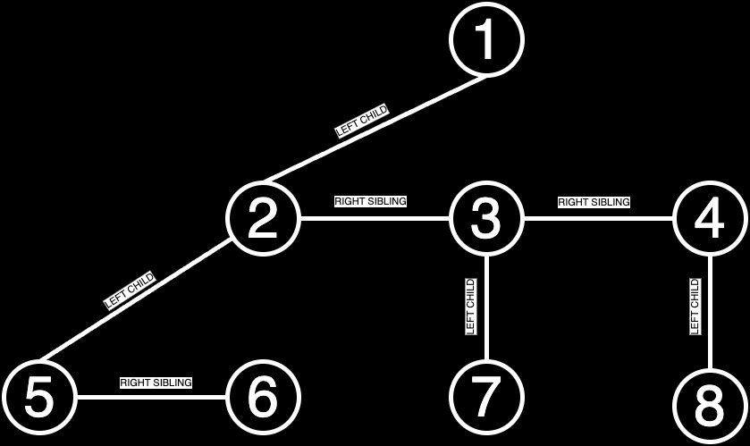
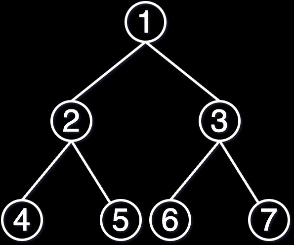
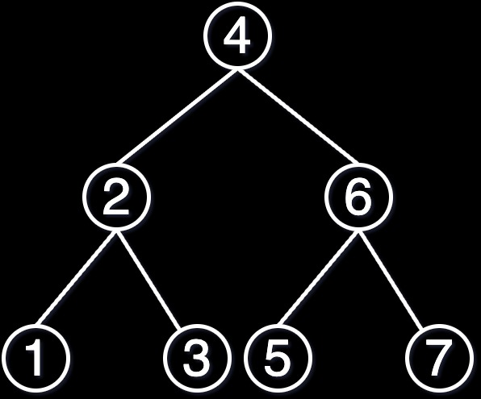
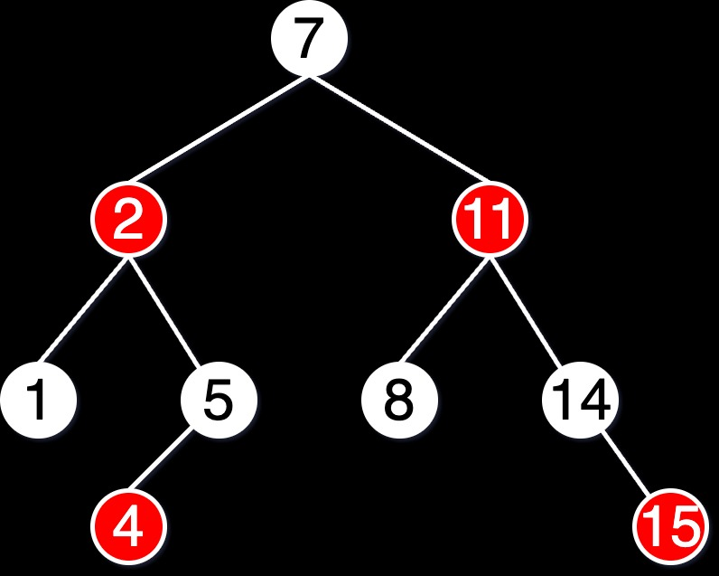
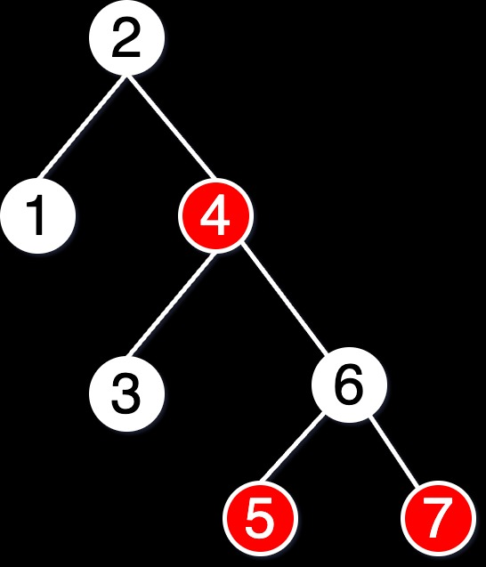

# 1DV516 A2

Name: Rihards Okmanis  
Email: ro222ij@student.lnu.se

In this assignment, I have used Python's inbuilt library for unit tests.
I followed the documentation outlined here:
https://docs.python.org/3/library/unittest.html

# Task 01: LCRSNode Implementation

The `LCRSNode` class includes the following methods:

- **`add_child(key)`**: Adds a child node with the specified key to the current node.
- **`degree()`**: Returns the number of immediate children of the node.
- **`height()`**: Calculates the height of the subtree rooted at the current node.
- **`is_leaf()`**: Determines if the node is a leaf (i.e., it has no children).
- **`size()`**: Computes the total number of nodes in the subtree rooted at the current node.
- **`walk()`**: Executes a pre-order traversal of the subtree, printing the key of each node.

The methods in the `LCRSNode` class have the following time and space complexities:

- `add_child()`: O(n) where n is the number of children (due to traversal to find the last sibling)
- `degree()`: O(n) where n is the number of children
- `height()`: O(n) where n is the number of nodes in the subtree
- `is_leaf()`: O(1)
- `size()`: O(n)
- `walk()`: O(n)

Space Complexity: O(n) since all nodes are stored in memory.

Each method has a corresponding test case in `Task01/tests.py`.

Edge cases considered:

- **Empty Tree**: The `test_empty_tree()` method verifies the behavior of an empty tree, ensuring it is recognized as a leaf with a size of 1.
- **Single Node Tree**: The `test_single_node_tree()` method checks that a single-node tree is correctly identified as a leaf with a size of 1.

The tree defined in the `setUp` method of the test class is illustrated below:

# Task 02: BinaryTree Implementation

The `BinaryTree` class includes the following methods:

- **`insert(value)`**: Inserts a new node with the given value into the binary tree using level-order insertion.
- **`depth()`**: Calculates the depth of the node in the tree.
- **`height()`**: Calculates the height of the subtree rooted at the current node.
- **`is_leaf()`**: Checks if the node is a leaf (i.e., it has no children).
- **`size()`**: Computes the total number of nodes in the subtree rooted at the current node.
- **`traverse()`**: Performs an in-order traversal of the subtree, printing the value of each node.

The methods in the `BinaryTree` class have the following time and space complexities:

- `insert()`: O(n) in the worst case due to level-order insertion in unbalanced trees.
- `depth()`: O(d) where d is the depth of the node.
- `height()`: O(n) where n is the number of nodes in the subtree.
- `is_leaf()`: O(1)
- `size()`: O(n)
- `traverse()`: O(n)

Space Complexity: O(n) where n is the number of nodes.

Each method has a corresponding test case in `Task02/tests.py`.

Edge cases considered:

- **Empty Tree**: The `test_empty_tree()` method ensures that an empty tree has a root of `None` and a size of 0.
- **Single Node Tree**: The `test_single_node_tree()` method confirms that a single-node tree is a leaf with a size of 1.
- **Duplicate Insertion**: The `test_insert_duplicate()` method verifies that duplicate values are not inserted into the tree, maintaining the tree's integrity.

The tree defined in the `setUp` method of the test class is illustrated below:

# Task 03: BinarySearchTree Implementation

The `BinarySearchTree` class includes the following methods:

- **`insert(value)`**: Adds a new node with the given value to the binary search tree.
- **`depth()`**: Calculates the depth of the node in the tree.
- **`height()`**: Calculates the height of the subtree rooted at the current node.
- **`is_leaf()`**: Checks if the node is a leaf (i.e., it has no children).
- **`search(value)`**: Finds a node with the given value in the binary search tree.
- **`size()`**: Computes the total number of nodes in the subtree rooted at the current node.
- **`traverse()`**: Performs an in-order traversal of the subtree, printing the value of each node.

The methods in the `BinarySearchTree` class have the following time and space complexities:

- **`insert()`**: O(log n) on average, O(n) in the worst case for degenerate trees.
- **`depth()`**: O(d) where d is the depth of the node.
- **`height()`**: O(n) where n is the number of nodes in the subtree.
- **`is_leaf()`**: O(1)
- **`search()`**: O(log n) on average, O(n) in the worst case.
- **`size()`**: O(n)
- **`traverse()`**: O(n)

Space Complexity: O(n) where n is the number of nodes.

Each method has a corresponding test case in `Task03/tests.py`.

Edge cases considered:

- **Empty Tree**: The `test_empty_tree()` method checks that an empty tree has a root of `None` and a size of 0.
- **Single Node Tree**: The `test_single_node_tree()` method verifies that a single-node tree is a leaf with a size of 1.
- **Duplicate Keys**: The `test_insert()` method ensures that duplicate values are not inserted into the tree.
- **Degenerate Tree**: The `test_degenerate_tree()` method tests the creation of a degenerate tree by inserting elements in sorted order, ensuring the tree's height corresponds to the number of edges.

The tree defined in the `setUp` method of the test class is illustrated below:

# Task 04: RedBlackTree Implementation

The `RedBlackTree` class includes the following methods:

- **`rb_insert(x)`**: Inserts a new node with the given value into the Red-Black Tree. If the value is a duplicate, the insertion is aborted.
- **`search(value)`**: Finds a node with the given value in the Red-Black Tree and returns the key if found, otherwise returns `None`.
- **`traverse()`**: Performs an in-order traversal of the tree, printing the key of each node.
- **`_print_tree(node=None, level=0)`**: Prints a description of the tree structure for debugging purposes.

The `RBNode` class represents a node in the Red-Black Tree and includes the following methods:

- **`add_child(new_node)`**: Adds a new node as a child of the current node. Returns `True` if successful, `False` if the node already exists.
- **`depth()`**: Calculates the depth of the node in the tree.
- **`height()`**: Calculates the height of the subtree rooted at the current node.
- **`is_leaf()`**: Checks if the node is a leaf (i.e., it has no children).
- **`size()`**: Computes the total number of nodes in the subtree rooted at the current node.

The methods in the `RedBlackTree` class have the following time and space complexities:

- **`rb_insert()`**: O(log n)
- **`search()`**: O(log n)
- **`traverse()`**: O(n)
- **`_print_tree()`**: O(n)

Space Complexity: O(n) where n is the number of nodes.

The `Color` class is an enumeration that defines the possible colors of a node in the Red-Black Tree: `RED` and `BLACK`.

Each method in the `RedBlackTree` and `RBNode` classes has corresponding test cases in `test.py`. The test suite includes:

- **`TestRBNode`**: Tests for the `RBNode` class, including initialization, adding children, and calculating properties like depth and height.
- **`TestRedBlackTree`**: Tests for the `RedBlackTree` class, including insertion, searching, and tree properties validation.

Edge cases considered:

- **Empty Tree**: The `test_empty_tree()` method verifies that an empty Red-Black Tree has a root of `None`.
- **Single Node Tree**: The `test_single_node_tree()` method ensures that a single-node Red-Black Tree has a root with a key and color `BLACK`.
- **Duplicate Keys**: The `test_insert_duplicate()` method confirms that duplicate values are not inserted into the tree.
- **Degenerate Tree**: The `test_degenerate_tree()` method ensures that the tree maintains its Red-Black properties, such as balanced height and no two red nodes adjacent, thus avoiding a degenerate structure.

The tree defined in the `setUp` method of the test class is illustrated below (black nodes are white on this diagram, sorry for inconvenience, draw.io exported weirdly):

The resulting tree for the degenerate test case is illustrated below:

